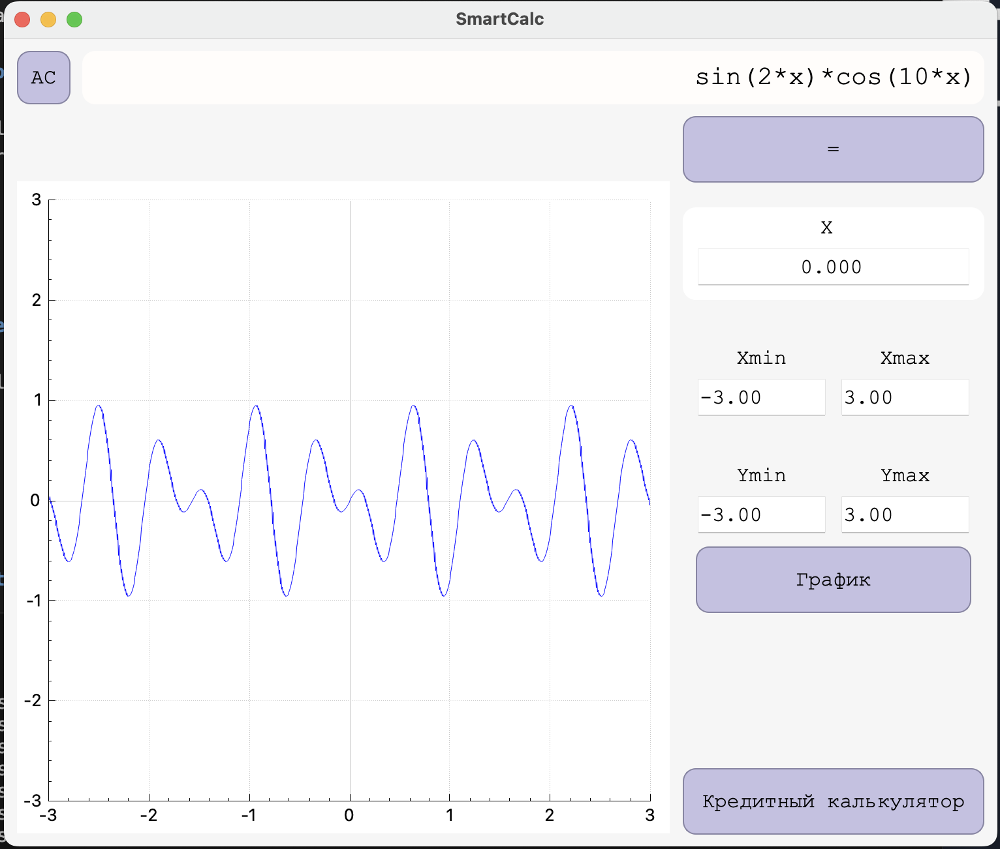
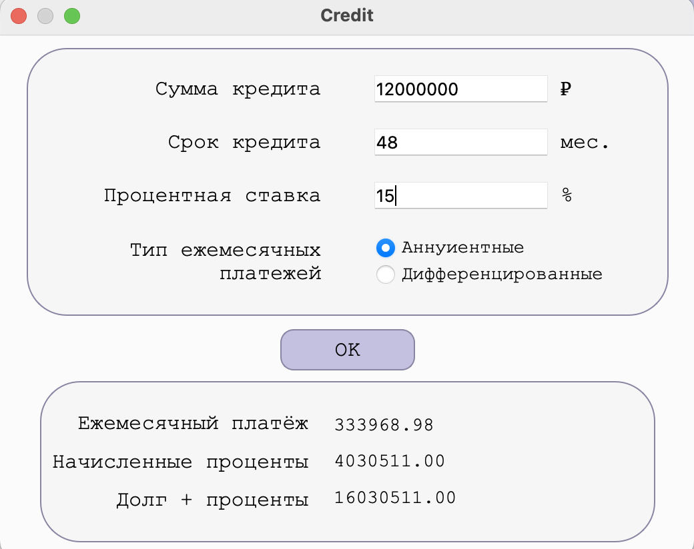

# SmartCalc

## Introduction

Implementation of extended version of the usual calculator, in the C++ language. In addition, implemented the ability to calculate arithmetic expressions by following the order, as well as some mathematical functions (sine, cosine, logarithm, etc.). Support's the use of the x variable and the graphing of the corresponding function.



In addition, implemented separate credit module to calculate Annuity/Differentiated loans.




## Dependencies

Make sure you have the following packages installed:

- 'GCC'
- 'G++'
- 'MAKE'
- 'QMAKE'
- 'QT5' and later

## Installation

- From src folder, run the following command (executable file will be located in the src folder)

```sh
make install
```

## File compression

- From src folder, run the following command (the archive will be located in the src folder)

```sh
make dist
```

## Uninstallation

- From src folder, run the following command

```sh
make uninstall
```
